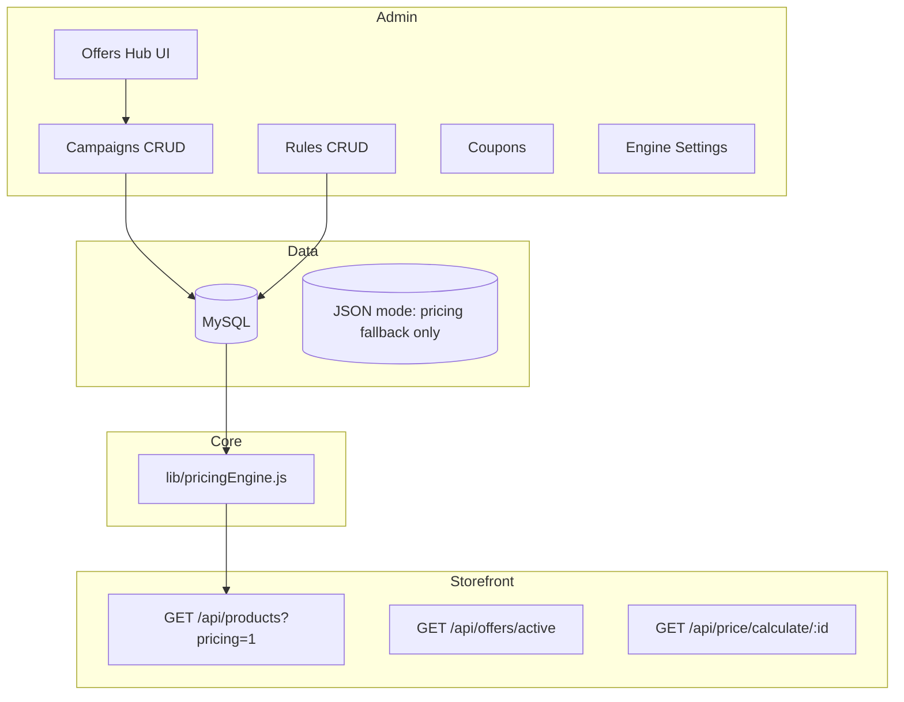

# Calvoro Discount & Seasonal Offer Engine

## Architecture (high level)

## Priority tiers (default order)

1. `flash` — tied to `seasonal_campaigns.is_flash_sale`
2. `seasonal` — campaign-scoped rules
3. `product` — `scope=product`, `product_id` set
4. `category` — `scope=category`, `category_id` set
5. `coupon` — `discount_coupons` → `discount_rules`

Admin can override stack behaviour via **Engine settings** (`resolution_mode`: `best_price` | `priority`, `allow_stack`, `tier_order` JSON).

## MySQL schema

Apply:

`backend/database/discount-engine-schema.sql`

Or rely on `ensureDiscountEngineTables()` on server boot (auto-creates tables).

## Public API

| Method | Path | Description |
|--------|------|-------------|
| GET | `/api/offers/active` | Active seasonal campaigns + engine settings snapshot |
| GET | `/api/price/calculate/:productId` | Product row enriched with `pricing` (optional `?coupon=CODE`) |
| GET | `/api/products?pricing=1` | Product list with `pricing`, `sold_out`, `display_price` |
| GET | `/api/products/:id?pricing=1` | Single product with pricing |

Pass `pricing=0` to skip enrichment (faster bulk).

## Admin API (session required)

Base: `/api/admin/discount-engine`

| Method | Path | Description |
|--------|------|-------------|
| GET/PUT | `/settings` | Engine resolution + stacking |
| GET/POST | `/campaigns` | Seasonal campaigns |
| PUT/DELETE | `/campaigns/:id` | Update / delete |
| GET/POST | `/rules` | Discount rules |
| PUT/DELETE | `/rules/:id` | Update / delete |
| GET/POST | `/coupons` | Coupon codes |
| GET | `/analytics/summary` | Aggregated usage |

Alias: `GET /api/analytics/discount-performance` (same data as analytics summary).

## Orders & stock

- **MySQL**: `createOrder` runs in a transaction: `SELECT ... FOR UPDATE` stock check → insert order/items → decrement `products.stock`.
- **JSON file DB**: same validation + updates `products.json`.
- Client receives `400` with `Insufficient stock` when quantity exceeds available.

## Security

- Admin routes require `req.session.admin`.
- `lib/adminRateLimit.js` sliding window on discount admin + analytics alias (default 200 req/min/IP).
- Validate discount inputs on create/update (extend as needed for production).

## Future (not implemented here)

- AI discount suggestions, A/B tests, email/SMS, full BI export — plug in via `discount_analytics` and workers.
- Server-side reconciliation of checkout line prices vs engine (recommended before payment capture).
